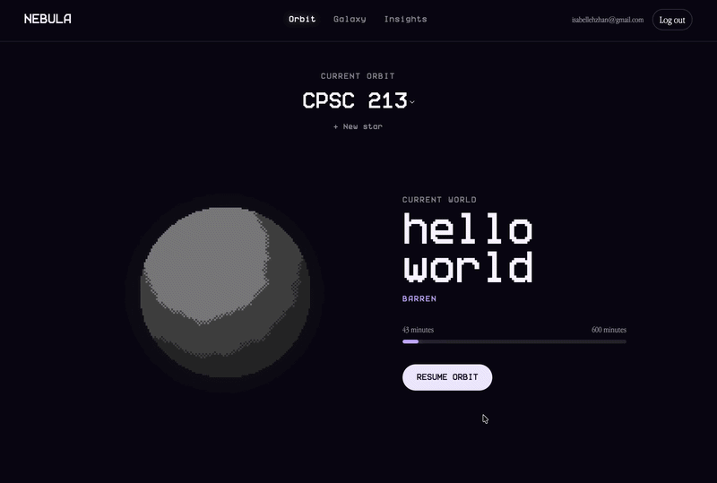
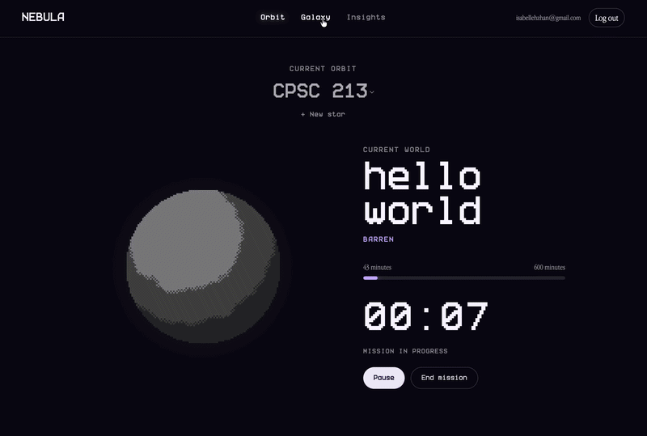
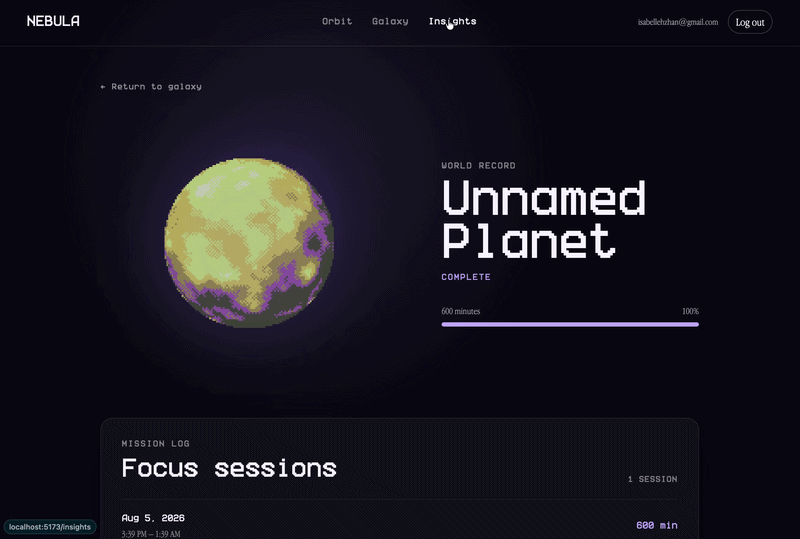

# Nebula

Nebula is a gamified focus web-application that turns time spent focused into an unique galaxy of planets.

Each subject is represented by a star. As users complete focus sessions, their active planet accumulates focus time and
evolves through multiple visual stages. Once fully evolved, the planet becomes part of that subject's permanent star
system and a new planet begins growing.

## Preview

### Orbit



### Galaxy



### Insights



## Overview

Nebula combines productivity tracking with procedural visualization.

study (time focusing)  
↓  
evolve a planet  
↓  
fully evolve the planet  
↓  
add it to a subject's star system

A subject represents what the user is focusing on, such as a university course. Each subject can accumulate multiple
planets over time.

## Features

- User registration and session-based authentication
- Subject creation and management
- Focus timer with pause, resume, and completion
- Persistent focus-session tracking
- Planet progression based on accumulated focus time
- Deterministic procedural planet generation
- Stage-based planet evolution
- Subject-based star systems
- Planet and subject detail views
- Weekly productivity analytics
- User-scoped data access and protected routes

## Tech Stack

### Backend

- Java
- Spring Boot
- Spring Data JPA
- Spring Security
- PostgreSQL
- Maven

### Frontend

- React
- Vite
- React Router
- Three.js / WebGL
- CSS

## Architecture

Nebula uses a layered backend architecture:

Controller  
↓  
Service  
↓  
Repository  
↓  
PostgreSQL

The primary domain relationships are:

User  
↓  
Subject  
↓  
Planet  
↓  
FocusSession

## Running Locally

### Prerequisites

- Java
- Node.js
- Docker
- Docker Compose

### Start PostgreSQL

```bash
docker compose up -d
```

### Start the backend

```bash
./mvnw spring-boot:run
```

### Start the frontend

```bash
cd frontend
npm install
npm run dev
```

## Attributions

See ATTRIBUTIONS.md for third-party assets and libraries used by the project.